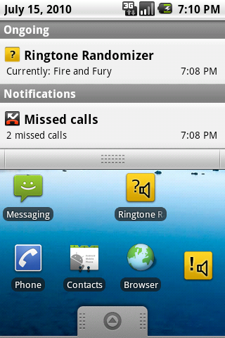

Ringtone Randomizer
==================

An Android ringtone randomizer app.

The Ringtone Randomizer is a simple application for Google Android to change your current ringtone.
You can either have your ringtone changed automatically after each phone call or you can use the widget, notification or menu itself to manually change it.

==================

    
    Copyright © 2010 Fabio Berchtold
    
    This program is free software: you can redistribute it and/or modify
    it under the terms of the GNU General Public License as published by
    the Free Software Foundation, either version 3 of the License, or
    (at your option) any later version.

    This program is distributed in the hope that it will be useful,
    but WITHOUT ANY WARRANTY; without even the implied warranty of
    MERCHANTABILITY or FITNESS FOR A PARTICULAR PURPOSE.  See the
    GNU General Public License for more details.

    You should have received a copy of the GNU General Public License
    along with this program.  If not, see <http://www.gnu.org/licenses/>.
